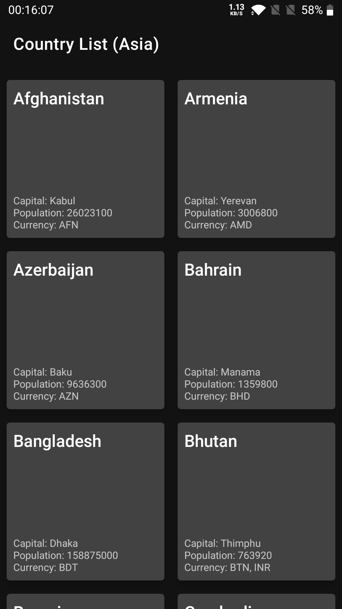
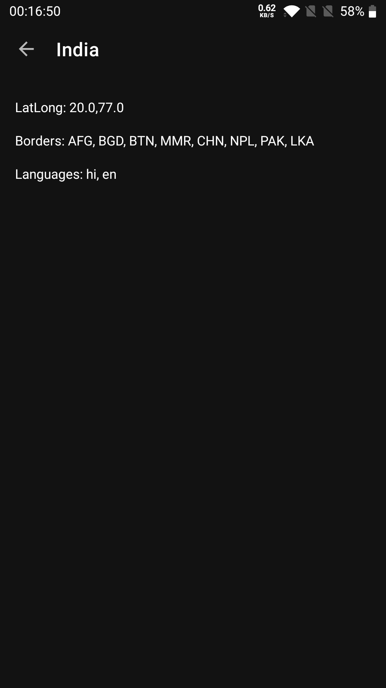
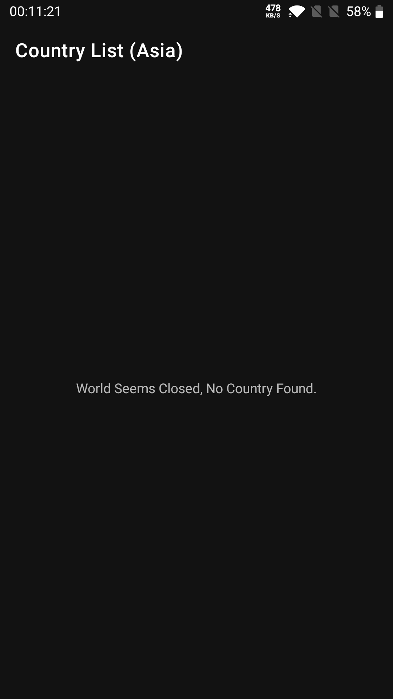

## Showing Country Data

Poc app which showcases a List of countries using Web Based APIs and Local Database in case of No Internet

Download [(Dev)](https://github.com/vishal1337/Countries/raw/master/apk_files/app_dev_debug.apk)
[(QA)](https://github.com/vishal1337/Countries/raw/master/apk_files/app_qa_debug.apk)
[(Prod)](https://github.com/vishal1337/Countries/raw/master/apk_files/app_prod_debug.apk) APK to try the App

<table>
  <tr>
    <td>Country List</td>
    <td>Country Details</td>
    <td>Empty List</td>
  </tr>
  <tr>
    <td></td>
    <td></td>
    <td></td>
  </tr>
</table>

# Description
- Multiple Flavours are available which can be installed at the same time.

# Highlights

- MVVM Architecture - To Organize Code
- Kotlin - Language used to write this Project
- Coroutines - To make use of suspend functions while making API calls
- Retrofit - Network Library
- Room - Wrapper for SQLIte
- GSON - Json Parsing Library
- Timber - Used for Logging
- Data Binding - To avoid boilerplate and attach the View to LiveData directly.
- LiveData - Observable data holder class
- ViewModel - to store and manage UI-related data in a lifecycle conscious way
- Navigation - To facilitate Navigation from one Screen to another
- Dagger2 - For Dependency Injection
